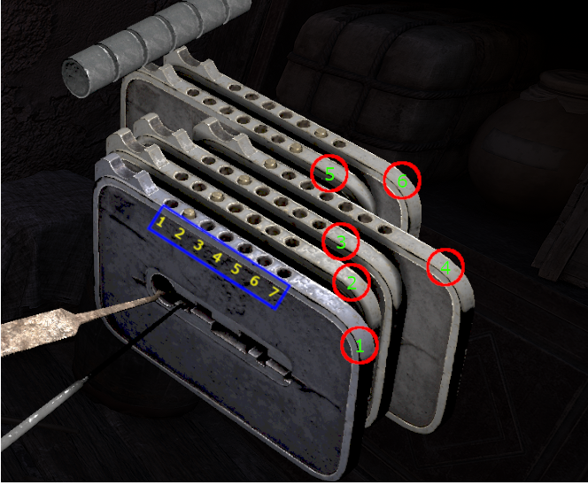
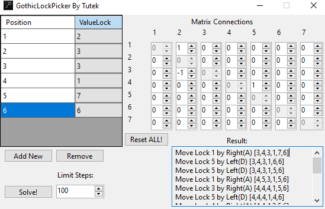

# GothicLockPicker
A simple tool to solve a puzzle game from the game Gothic Remake. Written in plain C# with WinForms

# Features
- Supports 1-7 plates of lock
- Supports Connections between plates using a connections matrix
- Uses the algorithm A* with a heuristic
- Limits the maximum number of solving steps
- Finds the minimum required steps to open the lock

# Info About Lock

The lock in the game requires set each plate at middle latch. The latch value is between **1** and **7** for each plate.

Each plate could have connections with other plates. Moving the plate could move another plate in the same direction or the opposite.

#Usage the program

In order to use the GothicLockPicker needs connections between plates and current states latches.
Connection value:
- **-1** = opposite direction
- **0** = no connection
- **1** = The Same direction

# Possible Future Features
- Auto Solve In game by pressing keys
